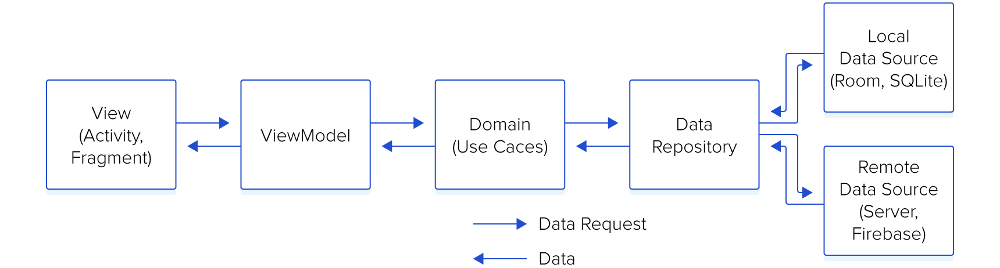
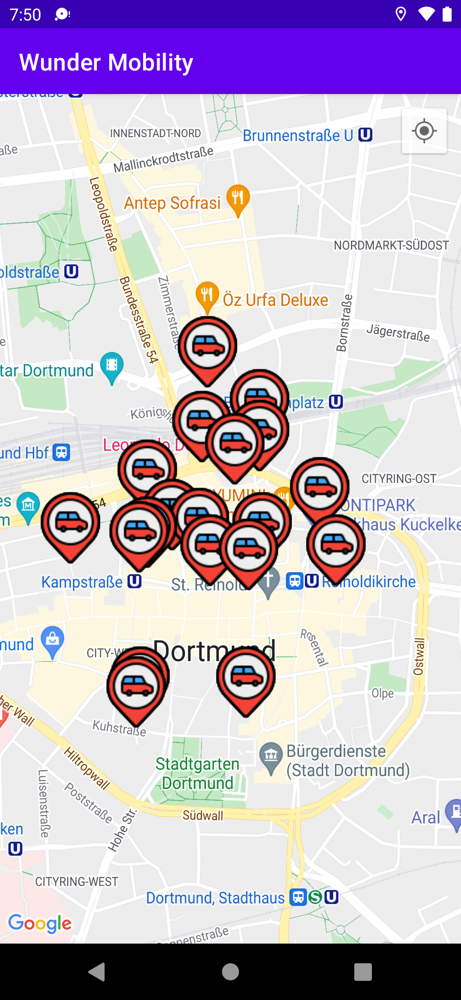
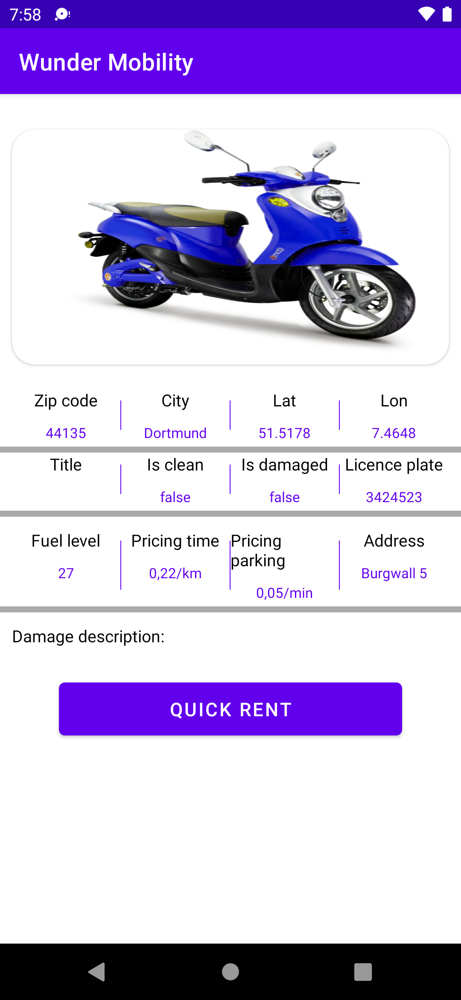

## Table of Contents

- [Architecture](#architecture)
- [Libraries](#libraries)
- [Screenshots](#screenshots)

## Architecture

the application is expected to scale with multiple developers working on it,
I used the Clean architectural principles to build the application.
I choose this architecture because it offers better separation of concerns and testability.

The Application is split into a three layer architecture:
- Data
- Domain
- Presentation

### Communication between layers
1. UI calls method from ViewModel.
2. ViewModel executes Use case.
3. Use case executes one or multiple Repositories function.
4. The Repository returns data from one or multiple Data Sources. the repository is the single source of truth
5. Information flows back to the UI where we display the data fetched from data sources.

this diagram show the flow of the data between the each layer.

This provides better abstractions between framework implementations and the underlying business logic.
It requires a number of classes to get things running but the pros outweigh the cons in terms of building an app that should scale.
The 3 layered architectural approach is majorly guided by clean architecture which provides a clear separation of concerns with its Abstraction Principle.

#### Presentation

I used the MVVM pattern for the presentation layer. The Model essentially exposes
the various states the view can be in. The ViewModel handles the UI logic and provides
data via Android architectural component StateFlow to the view. The ViewModel talks to
the domain layer with the individual use cases.

#### Domain

The domain layer contains the application specifics logic. It contains
use cases that expose the actions that can be performed in the application.

The UseCases use a `MainUseCase` interface that defines the parameters its taking in and
output and also handles running the UseCases in a background thread leveraging Kotlin Coroutines.

#### Data

The data layer handles the business logic and provides data from the API.
This layer uses the Repository pattern to fetch data from various data sources which in this case is the Remote API.

 
## Libraries

Libraries used in the whole application are:

- [Jetpack](https://developer.android.com/jetpack)🚀
  - [Viewmodel](https://developer.android.com/topic/libraries/architecture/viewmodel) -Store and manage UI related data in a lifecycle conscious way and act as a channel between use cases and ui
  - [StateFlow](https://developer.android.com/kotlin/flow/stateflow-and-sharedflow) - is a state-holder observable flow that emits the current and new state updates to its collectors.
  - [View Binding](https://developer.android.com/topic/libraries/view-binding) - support library that allows binding of UI components,view Binding replaces findViewById.
- [Retrofit](https://square.github.io/retrofit/) - type safe http client and supports coroutines out of the box.  
- [okhttp-logging-interceptor](https://github.com/square/okhttp/blob/master/okhttp-logging-interceptor/README.md) - logs HTTP request and response data.
- [coroutines](https://github.com/Kotlin/kotlinx.coroutines) - Library Support for coroutines,provides `runBlocking` coroutine builder used in tests
- [Material Design](https://material.io/develop/android/docs/getting-started/) - build awesome beautiful UIs.
- [Koin](https://github.com/InsertKoinIO/koin) - A pragmatic lightweight dependency injection framework for Kotlin

## Screenshots

  
  

